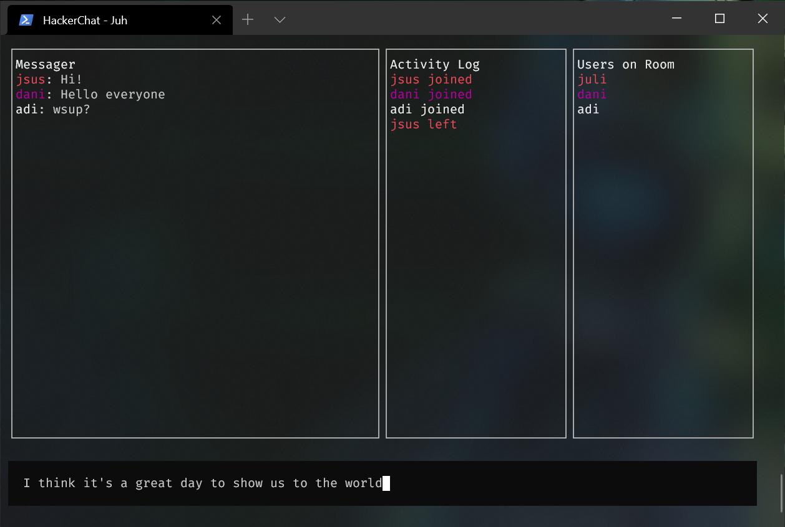

# Hacker Chat

This is a simple command line chat developed at JS Expert Week by Erick Wendel



## Requirements

Node ^15

## Running Project

### Client

```bash
$ cd client
$ npm init
```

### Server

```bash
$ cd server
$ npm init
```
